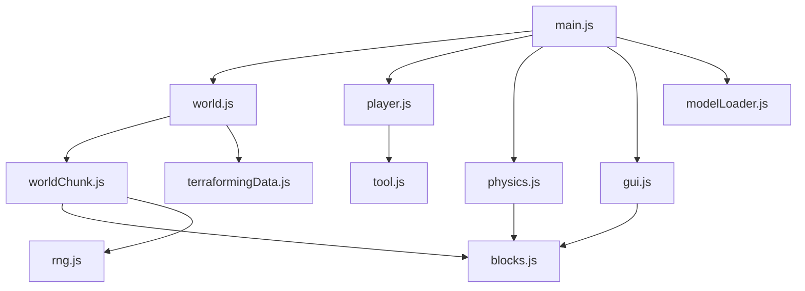

# 🟩 Threejs Minecraft

A **Minecraft-inspired 3D voxel world** built entirely in the browser using **Three.js**, **JavaScript**, and **Vite**. Explore a procedurally generated block-based world with terrain, trees, clouds, ores, physics, and full block placement/removal — all rendered in real-time with WebGL.

---

## 🌐 Live Demo

👉 **[Play it now!](https://rohit-nehate.github.io/threejs-minecraft/)**

---

## ✨ Features

### 🌍 World Generation
- **Procedural terrain** using Simplex Noise — rolling hills, flat plains, and sandy shores
- **Tree generation** with configurable trunk height, leaf radius, density, and spawn frequency
- **Cloud layer** rendered as translucent blocks at the world ceiling using noise-based density
- **Underground ore veins** — Stone, Coal Ore, and Iron Ore generated via 3D Simplex Noise with configurable rarity and scale
- **Water planes** — semi-transparent water surfaces at a configurable water level
- **Seeded RNG** — deterministic world generation using a custom Multiply-with-Carry random number generator

### 🧱 Block Types
| ID | Block | Texture |
|----|------------|--------------------------------------|
| 0 | Empty | — |
| 1 | Grass | Multi-face (top, sides, bottom) |
| 2 | Dirt | Single texture |
| 3 | Stone | Single texture (underground ore) |
| 4 | Coal Ore | Single texture (underground ore) |
| 5 | Iron Ore | Single texture (underground ore) |
| 6 | Oak Log | Multi-face (sides + top/bottom) |
| 7 | Oak Leaves | Single texture |
| 8 | Sand | Single texture (near water level) |
| 9 | Oak Planks | Single texture |
| 10 | Cloud | Translucent white (non-collidable) |

### 🏗️ Block Interaction
- **Left-click** to break/remove a block
- **Right-click** to place the currently selected block on the face of an existing block
- Smart placement — blocks cannot be placed inside the player's bounding volume
- Neighboring block visibility is automatically updated on add/remove (hidden face culling)

### 🎮 Player Controls
| Key | Action |
|---------|-------------------------------|
| `W` | Move forward |
| `A` | Move left |
| `S` | Move backward |
| `D` | Move right |
| `Space` | Jump |
| `Shift` | Sprint (1.5× speed) |
| `1`–`9` | Select block from toolbar |
| `R` | Reset camera height |
| `O` | Toggle orbit camera mode |
| `P` | Save game |
| `L` | Load game |

### 🧲 Physics Engine
- Custom **fixed-timestep physics simulation** (200 Hz) with frame-rate independent accumulator
- **Gravity** at 32 units/s²
- **Broad-phase collision detection** — AABB scan around the player to find candidate blocks
- **Narrow-phase collision detection** — cylinder-vs-block closest-point collision test
- **Collision resolution** — sorted by overlap to resolve deepest penetrations first; velocity adjustment prevents falling through blocks
- Clouds are excluded from collision detection

### 🗺️ Chunk System
- World divided into **32×32×32 chunks** for efficient rendering
- **Dynamic chunk loading/unloading** based on player position and configurable render distance
- **Async chunk generation** via `requestIdleCallback` to prevent frame drops
- **InstancedMesh rendering** — all blocks of the same type in a chunk share a single draw call
- **Occlusion culling** — fully surrounded blocks are excluded from the mesh to reduce draw calls

### 💾 Save / Load System
- World parameters and player modifications are **saved to `localStorage`**
- Pressing `P` saves, `L` loads — with in-game notification feedback
- Player block changes (additions/removals) are tracked via a `DataStore` keyed by chunk and block coordinates

### 🛠️ Debug GUI (lil-gui)
A comprehensive debug panel (collapsed by default) with real-time controls for:
- **World** — chunk dimensions, fog near/far, async loading toggle, seed, terrain scale/magnitude/offset, render distance
- **Player** — speed, camera helper visibility, collision helper visibility, player helper visibility
- **Resources** — per-resource scale (x/y/z) and rarity for Stone, Coal Ore, Iron Ore
- **Trees** — toggle generation, trunk height min/max, spawn frequency, leaf density, leaf radius min/max
- **Clouds** — scale, density, toggle generation

Changes to any parameter instantly regenerate the world.

### 📦 3D Block Models (GLTF)
- 9 block models loaded as `.glb` files via `GLTFLoader`
- Displayed as a **held item** in the player's hand (bottom-right of screen)
- Animated with a **swing animation** on click using sine-wave rotation

---

## 🏛️ Architecture

```
threejs-minecraft/
├── .github/
│   └── workflows/
│       └── static.yml          # GitHub Pages deployment (Vite build → deploy)
├── public/
│   ├── bg.png                  # Start screen background image
│   ├── minecraft.png           # Favicon
│   ├── inventory-icons/        # 9 toolbar icon PNGs (grass, dirt, stone, etc.)
│   ├── models/                 # 9 GLTF (.glb) 3D block models
│   └── textures/               # 18 block textures (PNG) + normal map
├── src/
│   ├── main.js                 # Entry point — scene, camera, renderer, lights, game loop
│   ├── world.js                # World class — chunk management, save/load, block operations
│   ├── worldChunk.js           # WorldChunk class — terrain/tree/cloud/resource/mesh generation
│   ├── player.js               # Player class — controls, raycasting, movement, toolbar
│   ├── physics.js              # Physics class — gravity, collision detection & resolution
│   ├── blocks.js               # Block definitions, textures, materials, resource list
│   ├── tool.js                 # Tool class — held item display & swing animation
│   ├── gui.js                  # Debug GUI setup (lil-gui)
│   ├── rng.js                  # Seeded RNG (Multiply-with-Carry algorithm)
│   ├── modelLoader.js          # GLTFLoader wrapper for loading block models
│   ├── terraformingData.js     # DataStore class — tracks player block modifications
│   └── style.css               # Styles — Minecraftia font, toolbar, crosshair, start screen
├── index.html                  # HTML shell — start screen, toolbar, crosshair, HUD
├── vite.config.js              # Vite config with conditional base path for GitHub Pages
├── package.json                # Dependencies: three, vite
└── .gitignore
```

### Module Dependency Graph



---

## 🛠️ Tech Stack

| Technology | Purpose |
|---|---|
| **[Three.js](https://threejs.org/)** `v0.182` | 3D rendering engine (WebGL) |
| **JavaScript** (ES Modules) | Application logic |
| **[Vite](https://vitejs.dev/)** `v7.2` | Dev server, HMR, and production bundler |
| **SimplexNoise** (Three.js addon) | Procedural noise for terrain & clouds |
| **lil-gui** (Three.js addon) | Debug parameter UI |
| **GLTFLoader** (Three.js addon) | 3D model loading |
| **PointerLockControls** (Three.js addon) | First-person camera controls |
| **OrbitControls** (Three.js addon) | Free-look orbit camera |
| **HTML + CSS** | UI layout, toolbar, start screen |

---

## ▶️ Getting Started

### Prerequisites
- **Node.js** (v16 or later recommended)
- **npm**

### Installation

```bash
# Clone the repository
git clone https://github.com/Rohit-Nehate/threejs-minecraft.git

# Navigate into the project
cd threejs-minecraft

# Install dependencies
npm install

# Start the development server
npm run dev
```

The app will be available at `http://localhost:5173` (default Vite port).

### Production Build

```bash
# Build for production
npm run build

# Preview the production build locally
npm run preview
```

The built files are output to the `dist/` directory.

---

## 🚀 Deployment

This project is configured for **automatic deployment to GitHub Pages** using GitHub Actions.

### How It Works
1. Every push to the `main` branch triggers the workflow (`.github/workflows/static.yml`)
2. The workflow installs dependencies, runs `npm run build`, and deploys the `dist/` folder to GitHub Pages
3. The `vite.config.js` sets the `base` path to `/threejs-minecraft/` in production to ensure correct asset resolution on GitHub Pages

### Manual Deployment
To deploy manually, push your changes to the `main` branch — the GitHub Action handles the rest.

---

## ⚙️ Configuration

All world generation parameters can be tuned in real-time via the **debug GUI** (top-right corner) or by modifying the defaults in `src/world.js`:

```javascript
params = {
  seed: 1,                        // World seed for deterministic generation
  terrain: {
    scale: 50,                    // Noise sample scale (larger = smoother terrain)
    magnitude: 5,                 // Height variation amplitude
    offset: 10,                   // Base terrain height
    waterOffset: 8,               // Water surface level
  },
  trees: {
    generateTrees: true,
    trunk: { minHeight: 4, maxHeight: 7 },
    leaves: { minRadius: 2, maxRadius: 4, density: 0.5 },
    frequency: 0.001,             // Tree spawn probability per block column
  },
  clouds: {
    scale: 20,                    // Cloud noise scale
    density: 0.2,                 // Cloud density threshold
    generateClouds: true,
  },
};
```

Additional settings:
- **Render distance** — `world.renderDistance` (default: `2`) — controls how many chunks are loaded around the player
- **Chunk size** — `world.size` (default: `32×32`) — width and height of each chunk
- **Player speed** — `player.maxSpeed` (default: `10`)
- **Jump velocity** — `player.jumpVelocity` (default: `10`)
- **Gravity** — `physics.gravity` (default: `32`)
- **Physics simulation rate** — `physics.simulationRate` (default: `200` Hz)

---

## 🎯 How It Works

### Game Loop (`main.js`)
1. **Physics update** — applies gravity, moves the player, detects and resolves collisions
2. **World update** — loads/unloads chunks based on player position
3. **Player update** — raycasts for block selection, updates tool animation
4. **Render** — renders the scene using either the first-person or orbit camera
5. **Shadow follow** — the directional light follows the player to provide dynamic shadows

### Terrain Generation (`worldChunk.js`)
1. **Initialize** — create a 3D data array of empty blocks
2. **Generate resources** — fill underground blocks (stone, coal, iron) using 3D Simplex Noise
3. **Generate terrain** — create surface using 2D Simplex Noise for heightmap; grass on top, dirt below, sand near water
4. **Generate trees** — probabilistic tree placement on grass blocks above water level
5. **Generate clouds** — place translucent cloud blocks at ceiling using 2D Simplex Noise
6. **Load player changes** — apply any saved additions/removals from the DataStore
7. **Generate meshes** — create InstancedMesh for each block type, culling fully hidden blocks

### Collision Detection (`physics.js`)
1. **Broad phase** — scan all blocks within the player's axis-aligned bounding box
2. **Narrow phase** — for each candidate, find the closest point on the block to the player cylinder and check for overlap
3. **Resolution** — sort collisions by overlap, push the player out along the collision normal, and cancel velocity into the collision

---

## 📄 License

This project uses the **Minecraftia** font by Andrew Tyler, licensed under [Creative Commons Attribution Share Alike](http://creativecommons.org/licenses/by-sa/3.0/).

---

## 🤝 Contributing

Contributions are welcome! Feel free to open issues or submit pull requests.

1. Fork the repository
2. Create your feature branch (`git checkout -b feature/amazing-feature`)
3. Commit your changes (`git commit -m 'Add amazing feature'`)
4. Push to the branch (`git push origin feature/amazing-feature`)
5. Open a Pull Request

---

## 📬 Contact

**Rohit Nehate** — [GitHub](https://github.com/Rohit-Nehate)

---

<p align="center">
  <b>⭐ Star this repo if you found it interesting!</b>
</p>
